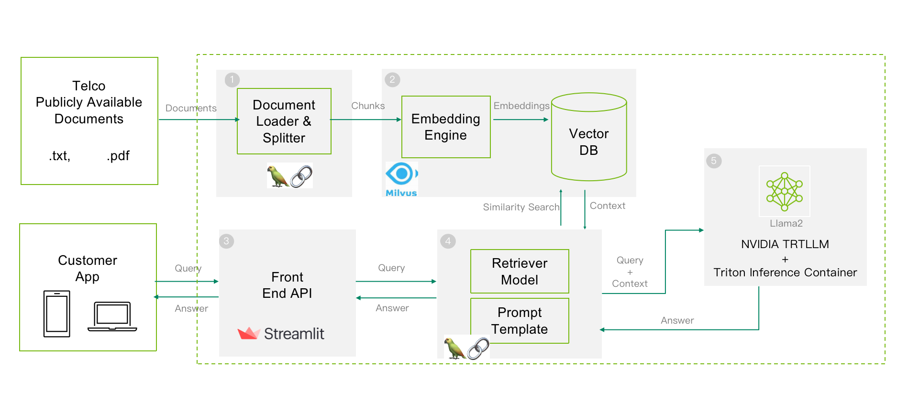

## Introduction
Developed jointly by [Quantiphi Inc](www.quantiphi.com) and [NVIDIA](https://www.nvidia.com/en-us/), this repository provides an example of an LLM-based RAG (Retriever Augmented Generation) pipeline to accelerate and simplify the implementation of chatbot solutions in the Telco industry. 

<p float="left">
    
</p>

## Architecture


**The workflow was tested on a single NVIDIA A100 GPU (80GB GPU Memory)** 

## Tech Stack
- Langchain
- TensorRT-LLM
- Triton Inference Server
- Milvus
- Hugging Face
- Streamlit
- FastAPI

## Setting up Project Locally

Cloning the repo containes services along with   **tensorrtllm_backend** as a submodule which comes with submodules that can be updated with the commands below.

```shell
cd tensorrtllm_backend/
git lfs install
git lfs pull
git submodule update --init --recursive
cd ../
```
Clone and place a embedding model of choice under `backend/embedding_model`. We have used `BAAI/bge-base-en-v1.5`.
any changes to the embedding model has to be updated in backend/config.yml file.

```shell
git clone https://huggingface.co/BAAI/bge-base-en-v1.5 backend/embedding_model/BAAI/bge-base-en-v1.5
```
We have the fronend, backend and Milvus DB as a microservice which can be started using the compose file provided along with the project.

```shell
docker compose up -d
```
Starting the backend would also mount './dataset' folder inside the container. To index the data into the vector database hit the /ingest_data endpoint with the dataset folder. This would chunk the data and index the same for RAG Pipeline.

```shell
curl  -X POST \
  'http://localhost:9999/ingest_data' \
  --header 'Accept: */*' \
  --header 'Content-Type: application/json' \
  --data-raw '{
  "path":"/dataset"
}'
```

## To Start LLM Service
In the below examples we show the commands for running a gated [LLAMA2-13b-chat](meta-llama/Llama-2-13b-chat-hf) model. We would need the huggingface token to be passed in the env variable of the below command. We can also adjust the GPU that is going to be used for triton inference server. In our case we are using gpu rank 1 for running it.

Running this docker container will add the container to the same network as other microservices, so that they can communicate with each other.

```shell
# Update HF_TOKEN
docker run --rm -it --env HF_TOKEN=hf_* \
--name=triton_server --network rag_accelerator \
-p8000:8000 -p8001:8001 -p8002:8002 --shm-size=2g \
--ulimit memlock=-1 --ulimit stack=67108864 \
--gpus '"device=1"' -v ./tensorrtllm_backend:/tensorrtllm_backend \
nvcr.io/nvidia/tritonserver:23.10-trtllm-python-py3 bash
```

### Install LLaMa2 requirements
The following commands are to be executed inside the docker container that we started in the above. Command assumes that we already have the engine file for the model that we are deploying. Follow this [document to create the engine file](https://github.com/NVIDIA/TensorRT-LLM#quick-start). We have to adjust the commands based on the model that we are using and the location where we put the engine files. This example assumes that we have 2 folders
- tensorrtllm_backend/tensorrt_llm/examples/llama/Llama-2-13b-chat-hf
- tensorrtllm_backend/tensorrt_llm/examples/llama/Llama-2-13b-chat-hf-engine

First one for the hugging face model and the second one for storing the engine file created by TensorRT-LLM.

Login with HF_TOKEN inside the container using `huggingface-cli login --token $HF_TOKEN` 

Install the requirements of llama model.
`pip install -r /tensorrtllm_backend/tensorrt_llm/examples/llama/requirements.txt && pip install protobuf`

### Copy config
`cp -R /tensorrtllm_backend/all_models/inflight_batcher_llm /opt/tritonserver/.`

### Configuration of Triton Inference Server
```
sed -i 's#${tokenizer_dir}#meta-llama/Llama-2-13b-hf#' /opt/tritonserver/inflight_batcher_llm/preprocessing/config.pbtxt && \
sed -i 's#${tokenizer_type}#llama#' /opt/tritonserver/inflight_batcher_llm/preprocessing/config.pbtxt && \
sed -i 's#${tokenizer_dir}#meta-llama/Llama-2-13b-hf#' /opt/tritonserver/inflight_batcher_llm/postprocessing/config.pbtxt && \
sed -i 's#${tokenizer_type}#llama#' /opt/tritonserver/inflight_batcher_llm/postprocessing/config.pbtxt && \
sed -i 's#${decoupled_mode}#true#' /opt/tritonserver/inflight_batcher_llm/tensorrt_llm/config.pbtxt && \
sed -i 's#${engine_dir}#/tensorrtllm_backend/tensorrt_llm/examples/llama/Llama-2-13b-chat-hf-engine/1-gpu/#' /opt/tritonserver/inflight_batcher_llm/tensorrt_llm/config.pbtxt
```

### Start Triton Server
Run the command to start the triton server: 
`tritonserver --model-repository=/opt/tritonserver/inflight_batcher_llm`

Now we have all the services ready. The frontend will be accessible on http://localhost:8501 port.

## About Quantiphi
Quantiphi is an award-winning AI-first digital engineering company driven by the desire to reimagine and realize transformational opportunities at the heart of the business. Since its inception in 2013, Quantiphi has solved the toughest and most complex business problems by combining deep industry experience, disciplined cloud, and data-engineering practices, and cutting-edge artificial intelligence research to achieve accelerated and quantifiable business results. Learn more at www.quantiphi.com.

## Reference
- [Llama2 trtllm guide](https://github.com/triton-inference-server/tutorials/blob/main/Popular_Models_Guide/Llama2/trtllm_guide.md)

 
